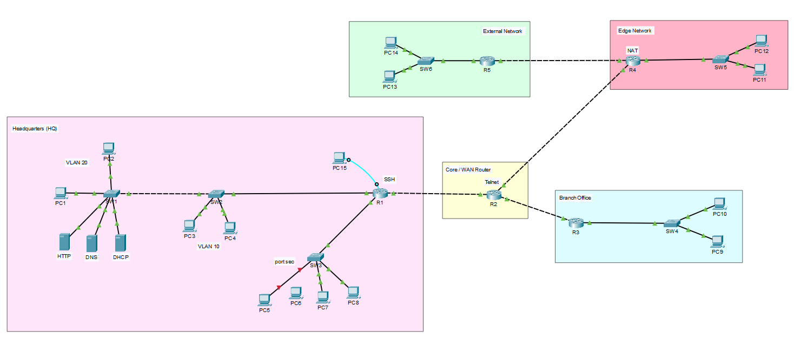

# Enterprise Network Infrastructure

## Overview

This project demonstrates the design and implementation of a secure enterprise network using Cisco Packet Tracer.

The network was designed to simulate a real enterprise environment with multiple LANs, routing protocols, network services, remote management, and security features.

---

## Project Topology

## Features

- Multi-router enterprise network topology
- VLAN segmentation (VLAN 10 & VLAN 20)
- Inter-VLAN Routing
- Static Routing
- RIP Routing
- Default Route
- DHCP Server
- DNS Server
- HTTP Server
- Network Address Translation (NAT)
- SSH Remote Management
- Telnet Remote Access
- Switch Port Security
- End-to-End Connectivity Testing