# Secure Enterprise Network Infrastructure

## Overview

This project demonstrates the design, implementation, and validation of a secure enterprise network using Cisco Packet Tracer.

The network simulates a real-world enterprise environment by integrating routing, switching, network services, remote management, and security technologies across multiple interconnected sites.

---

## Project Topology


---

## Features

- Multi-router enterprise network topology
- VLAN Segmentation
- Router-on-a-Stick (Inter-VLAN Routing)
- Static Routing
- RIPv2 Dynamic Routing
- Default Route
- DHCP Server
- DNS Server
- HTTP Server
- Static NAT
- SSH Remote Management
- Telnet Connectivity Testing
- Port Security
- Network Validation & Connectivity Testing

---

## VLANs & Inter-VLAN Routing

The enterprise network was segmented using Virtual LANs (VLANs) to improve network organization, reduce broadcast traffic, and enhance security.

| VLAN | Purpose | Connected Devices |
|------|---------|-------------------|
| VLAN 10 | User Network | PC3, PC4 |
| VLAN 20 | Server Network | HTTP Server, DNS Server, DHCP Server, PC1, PC2 |

Two IEEE 802.1Q trunk links were configured:

- SW1 ↔ SW2
- SW2 ↔ R1

Inter-VLAN communication was implemented using the Router-on-a-Stick technique. Router R1 was configured with dedicated subinterfaces for VLAN 10 and VLAN 20, allowing secure communication between both VLANs.

---

## DHCP Configuration

A dedicated DHCP server was configured to automatically assign IP addresses to devices within the Server Network.

### DHCP Settings

| Setting | Value |
|---------|-------|
| Pool Name | serverPool |
| Network | 192.168.20.0/24 |
| Default Gateway | 192.168.20.1 |
| DNS Server | 192.168.20.3 |
| Start IP Address | 192.168.20.5 |
| Maximum Users | 251 |

The DHCP service automatically distributes IP configuration to client devices, reducing manual configuration and simplifying network management.

### DHCP Server

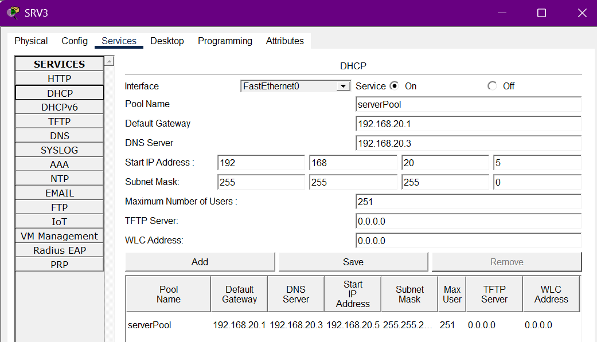

---

## DNS Configuration

A dedicated DNS server was configured to resolve internal hostnames within the enterprise network.

### DNS Record

| Hostname | Record Type | IP Address |
|----------|-------------|------------|
| www.cisco | A Record | 192.168.20.4 |

The DNS server enables users to access internal services using hostnames instead of IP addresses.

### DNS Server

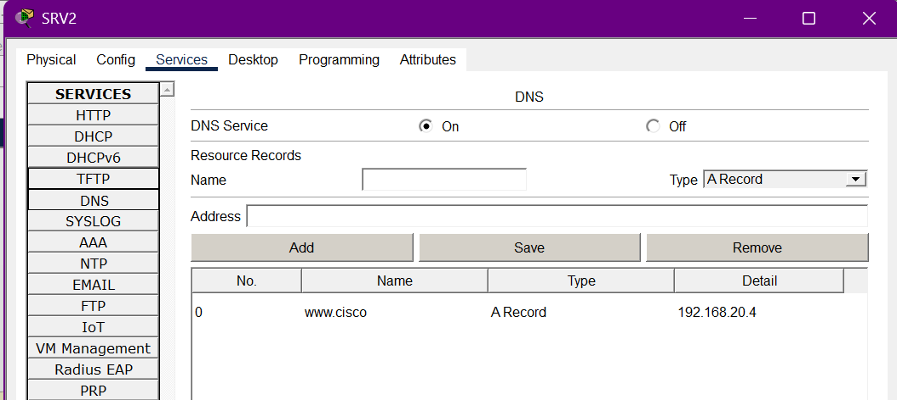

---

## HTTP Service

An internal web server was deployed and successfully accessed through DNS hostname resolution.

### Verification

The website was successfully accessed using:

```text
http://www.cisco
```

This validates:

- DNS name resolution
- HTTP service availability
- End-to-end network connectivity

### HTTP Verification

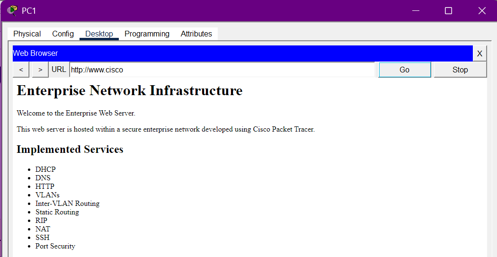

---

## SSH Remote Management

Secure Shell (SSH) was configured on Router R1 to provide secure remote administration.

### Configuration

- Local user authentication
- 2048-bit RSA key pair
- SSH enabled on VTY lines
- Domain name configured (NETWORK.LOCAL)

### Verification

SSH connectivity was successfully verified by establishing a secure remote session from Router R2 to Router R1.

```text
ssh -l saja 10.10.1.1
```

Successful authentication confirmed secure remote management between enterprise network devices.

### SSH Verification

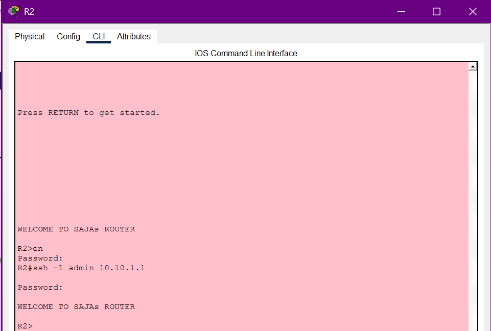

---

## Network Address Translation (NAT)

Static Network Address Translation (Static NAT) was implemented to provide communication between internal and external networks.

### NAT Translation

| Inside Local | Inside Global |
|--------------|---------------|
| 192.168.4.2 | 192.168.3.10 |

### Verification

The NAT translation table confirmed successful address translation during communication.

### NAT Verification

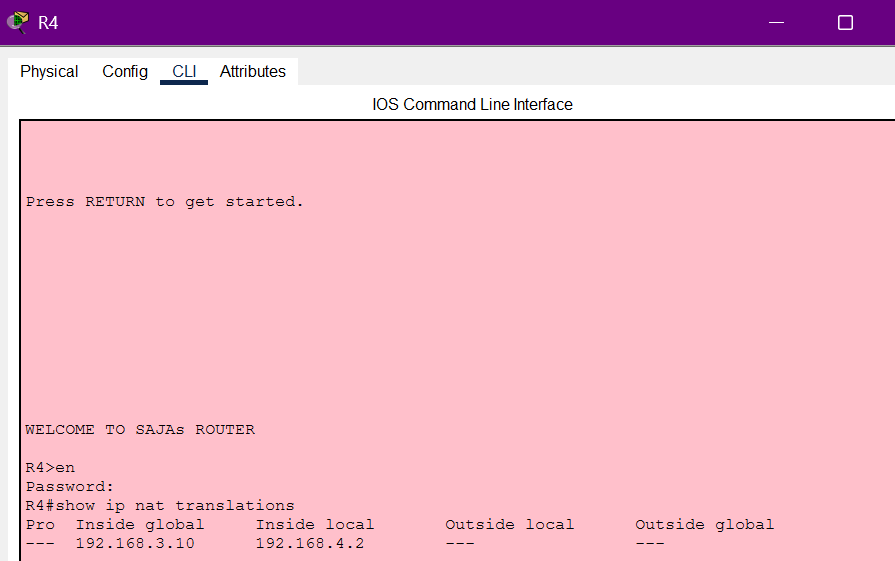

---

## Routing Configuration

The enterprise network uses a hybrid routing design combining Static Routing, RIPv2, and a Default Route to provide connectivity between headquarters, branch offices, and external networks.

### Routing Technologies

- Static Routing
- RIPv2 Dynamic Routing
- Default Route
- Router-on-a-Stick

### Static Routing

Static routes were configured on enterprise routers to provide deterministic paths toward selected remote networks.

### Dynamic Routing (RIPv2)

RIPv2 was implemented on R2, R3, and R4 to dynamically exchange routing information across WAN links.

Features:

- RIP Version 2
- No Auto-Summarization
- Dynamic Route Learning

### Default Route

A default route was configured on R4 to forward unknown traffic toward the external network.

### Verification Evidence

**R1 - Static Routing**


**R2 - Static Routing + RIPv2**

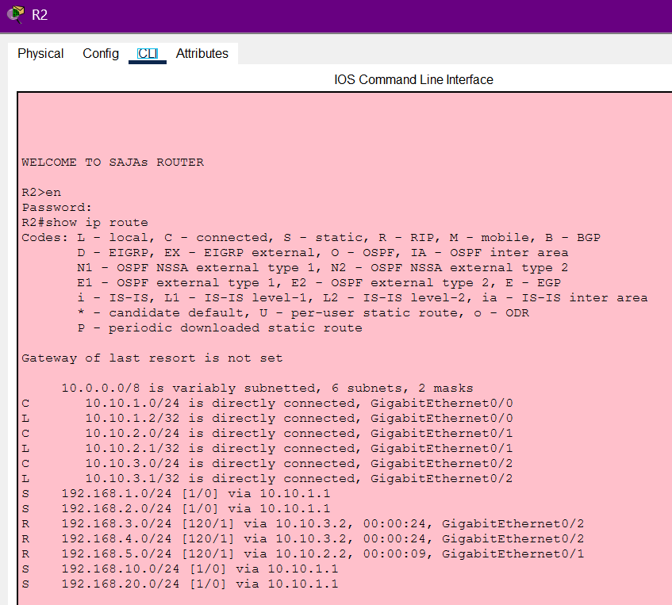

**R3 - Static Routing + RIPv2**

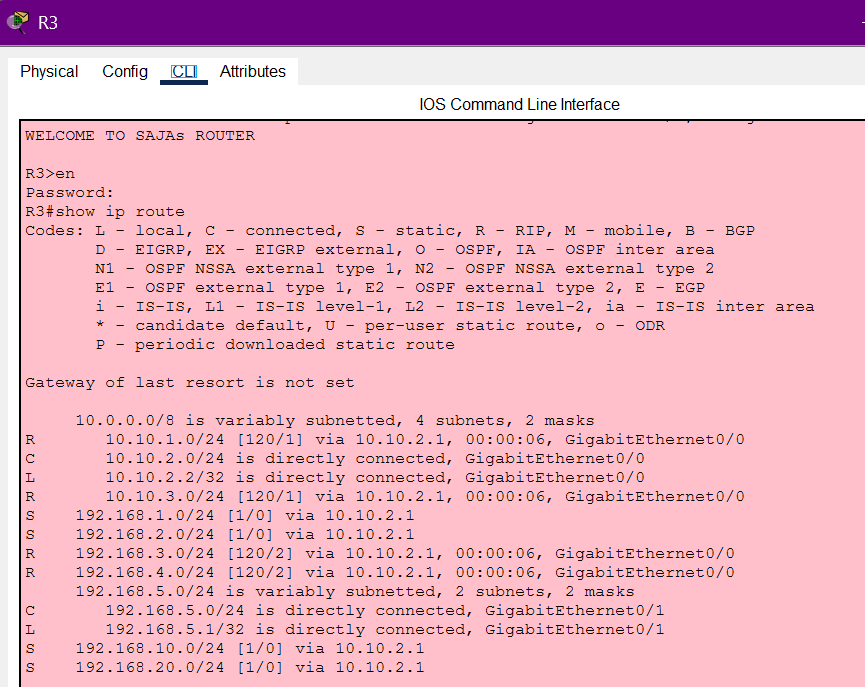

**R4 - RIPv2 + Default Route**

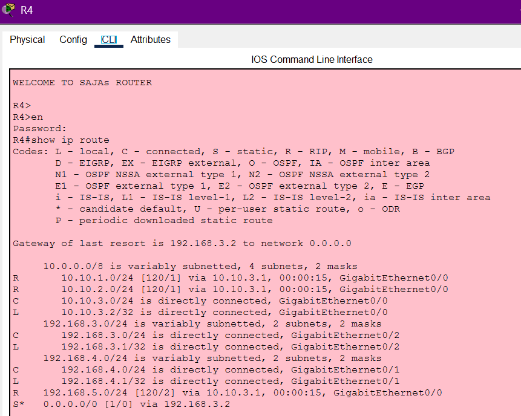

**R5 - External Static Routing**

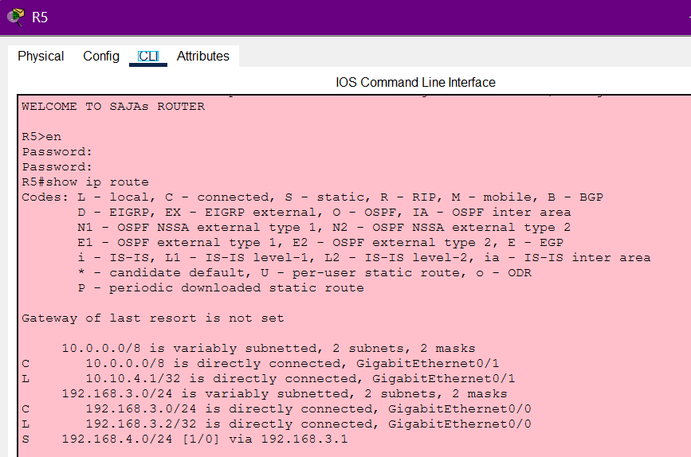

### RIPv2 Verification

**R2**

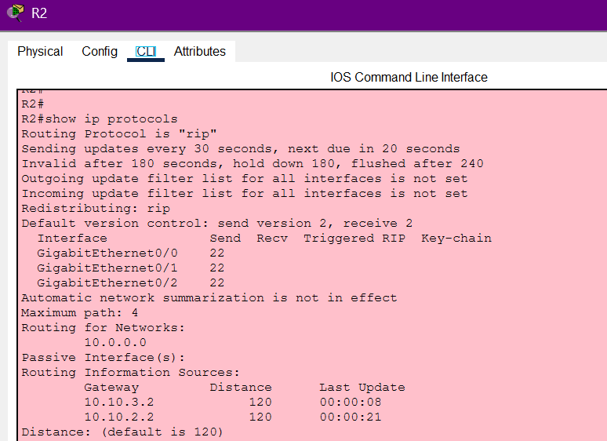

**R3**

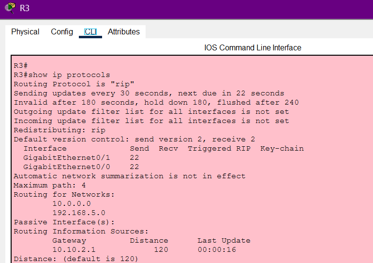

**R4**

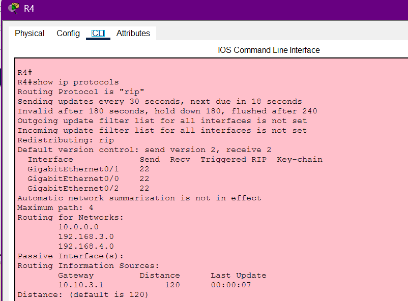

---

## Port Security

Port Security was configured on access switch ports to prevent unauthorized devices from accessing the enterprise network.

### Security Features

- Maximum Secure MAC Address: 1
- Sticky MAC Address Learning
- Violation Mode: Shutdown
- Automatic interface shutdown upon MAC address violation

### Security Test

An unauthorized device (**PC5**) was connected to a protected switch port.

The switch detected the MAC address violation and automatically placed the interface into a shutdown state, successfully preventing unauthorized network access.

### Verification Evidence

**Unauthorized Device**

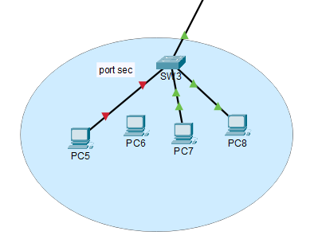

**Port Security Status**

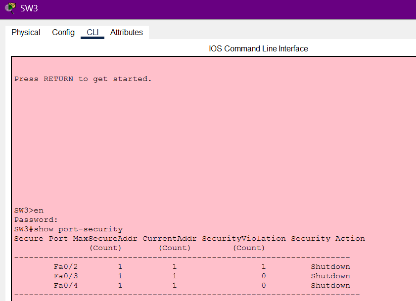

---

## Network Validation

The enterprise network was successfully validated after implementation to verify routing, connectivity, security, and network services.

### Validation Results

| Test | Status |
|------|--------|
| VLAN Connectivity | ✅ Passed |
| Inter-VLAN Routing | ✅ Passed |
| DHCP Address Assignment | ✅ Passed |
| DNS Name Resolution | ✅ Passed |
| HTTP Web Access | ✅ Passed |
| SSH Remote Login | ✅ Passed |
| Static Routing | ✅ Passed |
| RIPv2 Route Learning | ✅ Passed |
| Static NAT Translation | ✅ Passed |
| Port Security Enforcement | ✅ Passed |

### Testing Evidence

- DHCP clients successfully received IP addresses.
- DNS successfully resolved **www.cisco**.
- HTTP service was accessible using the configured hostname.
- SSH remote login was successfully established from R2 to R1.
- Static routes, RIPv2 learned routes, and the default route were successfully verified.
- Static NAT translation entries were successfully created.
- Port Security automatically blocked unauthorized devices.

---

## Technologies Used

- Cisco Packet Tracer
- Cisco IOS CLI
- Routing & Switching
- VLAN Segmentation
- IEEE 802.1Q Trunking
- Router-on-a-Stick
- Static Routing
- RIPv2
- Default Route
- DHCP
- DNS
- HTTP
- Static NAT
- SSH
- Telnet
- Port Security

---

## IP Addressing Plan

| Network | Subnet | Purpose | Gateway |
|---------|---------|---------|---------|
| VLAN 10 | 192.168.10.0/24 | User Network | 192.168.10.1 |
| VLAN 20 | 192.168.20.0/24 | Server Network | 192.168.20.1 |
| LAN | 192.168.2.0/24 | Port Security LAN | 192.168.2.1 |
| R1 ↔ R2 | 10.10.1.0/24 | WAN Link | - |
| R2 ↔ R3 | 10.10.2.0/24 | WAN Link | - |
| R2 ↔ R4 | 10.10.3.0/24 | WAN Link | - |
| R4 ↔ R5 | 192.168.3.0/24 | NAT Link | - |
| External LAN | 192.168.4.0/24 | External Network | 192.168.4.1 |

---

## Device Inventory

| Device | Role |
|---------|------|
| R1 | Headquarters Router (Inter-VLAN Routing & SSH) |
| R2 | Core Router (Static Routing & RIPv2) |
| R3 | Branch Router |
| R4 | Edge Router (Static NAT & Default Route) |
| R5 | External Router |
| SW1 | Access Switch (Servers & VLAN 20) |
| SW2 | Distribution Switch (802.1Q Trunk) |
| SW3 | Access Switch (Port Security) |
| HTTP Server | Internal Web Server |
| DNS Server | Internal DNS Server |
| DHCP Server | DHCP Service |
| PCs | Enterprise Clients |

---


